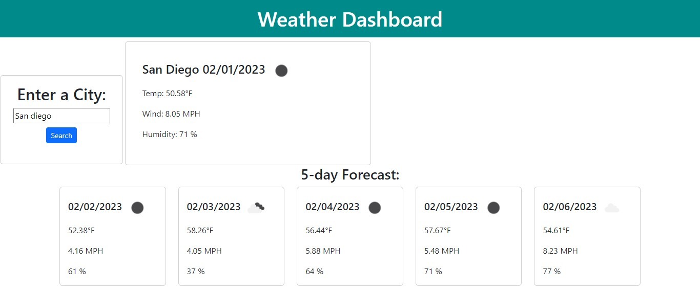

# 3rd-party-API-weather

## Description

Through the use of 3rd party APIs I created a simple weather dashboard that references a city's name. For this challenge I used the openweathermap api and pulled both current weather and a 5 day forecast data.

## User Story

```
AS A traveler
I WANT to see the weather outlook for multiple cities
SO THAT I can plan a trip accordingly
```

## Acceptance Criteria

```
GIVEN a weather dashboard with form inputs
WHEN I search for a city
THEN I am presented with current and future conditions for that city and that city is added to the search history
WHEN I view current weather conditions for that city
THEN I am presented with the city name, the date, an icon representation of weather conditions, the temperature, the humidity, and the the wind speed
WHEN I view future weather conditions for that city
THEN I am presented with a 5-day forecast that displays the date, an icon representation of weather conditions, the temperature, the wind speed, and the humidity
WHEN I click on a city in the search history
THEN I am again presented with current and future conditions for that city
```

## Screenshot



## Deployed URL

https://patrickmc19.github.io/3rd-party-API-weather/

## What was my motivation?

To continue to develop and master my coding abilities related to javascript, for loops, jquery, moment, append, empty, call to api array, using selectors, fetching a dynamic url based on user inputs, and styling for multiple devices.

## Why did I build this project?

To put the above coding terms into use. To challenge myself during a difficult group project week.

## What problem does it solve?

This allows for quick and easy access to the weather of your preferred city.

## What did you learn?

That I still have a lot to learn. That I need to brush up on styling and js - especially using local stoarge. That dayjs does not always convery time as expected.

## What makes your project stand out?

A dynamic for loop that pulls in the api data from the same time slot for each day. The use of moment to quick format the dt field to a user friendly date.